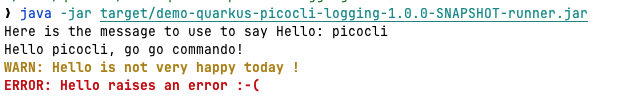
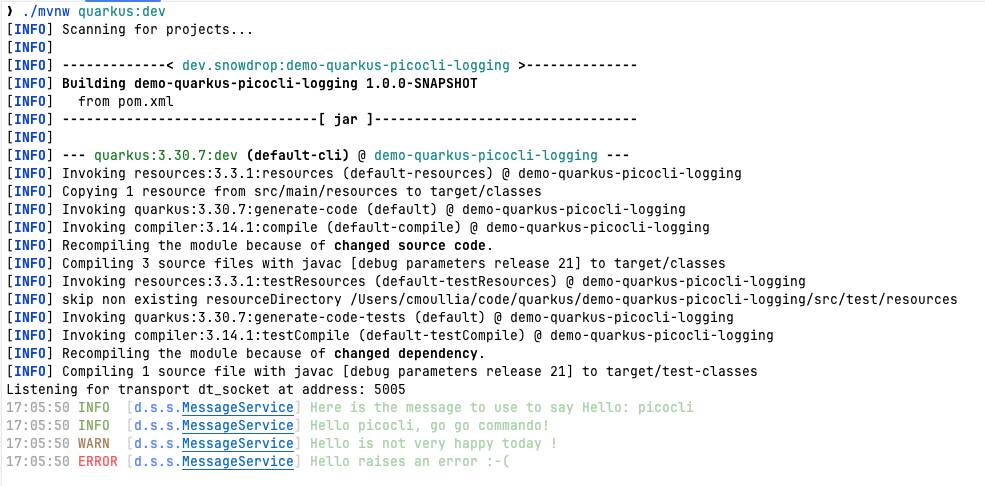

# How to use different logging format with Quarkus Picocli and dev mode

The goal of this project is to demo how we can configure different logging format top of a Quarkus and Picocli application
as the information to be shown to the user using the Picocli client is not the same as what we log on the console in development mode.

When the user runs the `CLI` using the `uber` jar (or jbang), then we use simple `ANSI` colored messages: 



But when it launches the application using `mvn quarkus:dev` mode, then the traditional `format` logging is used `h:m:s LEVEL [p.className] MESSAGE`: 



To support both modes, the property `cli.mode=true` has been created and the format of the messages logged adapted
```properties
# Quarkus banner disabled
quarkus.banner.enabled=false

# Quarkus dev mode
%dev.quarkus.log.console.format=%d{HH:mm:ss} %-5p [%c{1.}] %s%e%n
%dev.quarkus.log.level=INFO
%dev.quarkus.log.category."io.quarkus".level=WARN
%dev.cli.mode=false

# Client mode
%prod.quarkus.log.level=INFO
%prod.quarkus.log.category."io.quarkus".level=WARN
%prod.quarkus.log.console.format=%d{HH:mm:ss} %s%e%n
%prod.cli.mode=true
```

> [!NOTE] 
> The Quarkus logging and format documentation is available here: https://quarkus.io/guides/logging

A `LoggingFormatingService` java class must be created to handle according to the property set, the format of the message
```java
package dev.snowdrop.service;

import jakarta.enterprise.context.ApplicationScoped;
import org.eclipse.microprofile.config.inject.ConfigProperty;
import org.jboss.logging.Logger;
import picocli.CommandLine;

@ApplicationScoped
public class LoggingFormatingService {
    private static final Logger logger = Logger.getLogger(MessageService.class);
    private final String ANSI_WARN = "@|bold,yellow WARN: %s |@";
    private final String ANSI_ERROR = "@|bold,red ERROR: %s |@";
    private CommandLine.Model.CommandSpec spec;

    @ConfigProperty(name = "cli.mode", defaultValue = "false")
    boolean isCliMode;

    public LoggingFormatingService() {
    }

    public void info(String message) {
        if (isCliMode) {
            spec.commandLine().getOut().println(
                CommandLine.Help.Ansi.AUTO.string(message));
        } else {
            logger.info(message);
        }
    }

    public void warn(String message) {
        if (isCliMode) {
            spec.commandLine().getOut().println(
                CommandLine.Help.Ansi.AUTO.string(String.format(ANSI_WARN, message)));
        } else {
            logger.warn(message);
        }
    }

    public void error(String message) {
        if (isCliMode) {
            spec.commandLine().getOut().println(
                CommandLine.Help.Ansi.AUTO.string(String.format(ANSI_ERROR, message)));
        } else {
            logger.error(message);
        }
    }

    public void setSpec(CommandLine.Model.CommandSpec spec) {
        this.spec = spec;
    }
}
```

To use it, instantiate the service and use the method `setSpec` to provide the Picocli `CommandSpec` (see detail [here](https://picocli.info/apidocs/picocli/CommandLine.Model.CommandSpec.html)) able to log to the stdout or stderr the messages
formated using ANSI

```java
package dev.snowdrop;

import dev.snowdrop.logging.LoggingService;
import jakarta.inject.Inject;
import picocli.CommandLine.Command;

@Command(name = "greeting", mixinStandardHelpOptions = true)
public class GreetingCommand implements Runnable {

    @Inject
    LoggingService LOG;

    @Override
    public void run() {
        msgService.with("picocli");

        // Pass the Picocli Command Spec to the LOG service
        LOG.setSpec(spec);
```

## Running the application in dev mode

You can run your application in dev mode that enables live coding using:

```shell script
./mvnw quarkus:dev
```

> **_NOTE:_**  Quarkus now ships with a Dev UI, which is available in dev mode only at <http://localhost:8080/q/dev/>.

## Packaging and running the application

The application can be packaged using:

```shell script
./mvnw package
```

It produces the `quarkus-run.jar` file in the `target/quarkus-app/` directory.
Be aware that it’s not a _über-jar_ as the dependencies are copied into the `target/quarkus-app/lib/` directory.

The application is now runnable using `java -jar target/quarkus-app/quarkus-run.jar`.

If you want to build a _über-jar_, execute the following command:

```shell script
./mvnw package -Dquarkus.package.jar.type=uber-jar
```

The application, packaged as an _über-jar_, is now runnable using `java -jar target/*-runner.jar`.

## Related Guides

- Picocli ([guide](https://quarkus.io/guides/picocli)): Develop command line applications with Picocli

## Provided Code

### Picocli Example

Hello and goodbye are civilization fundamentals. Let's not forget it with this example picocli application by changing the <code>command</code> and <code>parameters</code>.

[Related guide section...](https://quarkus.io/guides/picocli#command-line-application-with-multiple-commands)

Also for picocli applications the dev mode is supported. When running dev mode, the picocli application is executed and on press of the Enter key, is restarted.

As picocli applications will often require arguments to be passed on the commandline, this is also possible in dev mode via:

```shell script
./mvnw quarkus:dev -Dquarkus.args='Quarky'
```

## TODO

### Aesh

Using Aesh and LogManager to colorize the messages to be logged

```bash
set AESH_GAV "$HOME/.m2/repository/dev/snowdrop/aesh/1.0.0-SNAPSHOT/aesh-1.0.0-SNAPSHOT-jar-with-dependencies.jar"
alias colorWithAesh='java -Djava.util.logging.manager=org.jboss.logmanager.LogManager -cp $AESH_GAV dev.snowdrop.ColorMsgAeshApp'
colorWithAesh
```

### LogManager

Using the JBoss LogManager and a ColorHandler for colorize and format the messages
```bash
set LOGMANAGER_GAV "$HOME/.m2/repository/dev/snowdrop/logmanager/1.0.0-SNAPSHOT/logmanager-1.0.0-SNAPSHOT-jar-with-dependencies.jar"
alias colorWithLogManager='java -Djava.util.logging.manager=org.jboss.logmanager.LogManager -cp $LOGMANAGER_GAV dev.snowdrop.ColorMsgLogManagerApp'
colorWithLogManager
```

### Picocli

Using the Picocli, Aesh and JBoss LogManager to colorize and format the messages
```bash
set PICOCLI_GAV "$HOME/.m2/repository/dev/snowdrop/picocli/1.0.0-SNAPSHOT/picocli-1.0.0-SNAPSHOT-jar-with-dependencies.jar"
alias colorWithPicocli='java -Djava.util.logging.manager=org.jboss.logmanager.LogManager -cp $PICOCLI_GAV dev.snowdrop.ColorWithQuarkusPicocli'
colorWithPicocli --name snowdrop
colorWithPicocli --name snowdrop --color
```

### Quarkus & Picocli

Using Quarkus Picocli, Aesh and JBoss LogManager to colorize and format the messages
```bash
alias colorWithQuarkusPicocli='java -Djava.util.logging.manager=org.jboss.logmanager.LogManager -jar ./target/quarkus-picocli-1.0.0-SNAPSHOT-runner.jar'
colorWithQuarkusPicocli -n quarkus
colorWithQuarkusPicocli -n quarkus -c

java -Dcli.log.msg.format="greeting-app: %s%e%n" -Djava.util.logging.manager=org.jboss.logmanager.LogManager -jar ./target/quarkus-picocli-1.0.0-SNAPSHOT-runner.jar -c 
```

