# Terminal-Aware Colorized Logging Demo

## Introduction

This project demonstrates intelligent terminal logging with automatic theme detection and adaptive colorization. It showcases how to create visually appealing, readable log messages that automatically adjust their color schemes based on whether your terminal is using a dark or light theme.

### Key Features

- **Automatic Theme Detection**: Detects terminal theme (dark/light) using [Aesh](https://github.com/aeshell/aesh) terminal library
- **Adaptive Colorization**: Dynamically adjusts log message colors for optimal readability
- **Multiple Implementation Approaches**: Demonstrates various logging strategies using:
  - [JBoss LogManager](https://github.com/jboss-logging/jboss-logmanager) with custom color formatters
  - [Picocli](https://picocli.info/) for CLI applications
  - [Quarkus](https://quarkus.io/) integration for modern Java applications
  - [JBang](https://www.jbang.dev/) for quick scripting scenarios

### Why This Matters

Reading logs in a terminal can be challenging, especially when color schemes clash with your terminal theme. This project solves that problem by automatically detecting your terminal's theme and applying appropriate colors, ensuring logs are always readable and visually distinct regardless of your environment preferences.

### Technologies Used

- **Aesh**: Terminal theme detection and ANSI color support
- **JBoss LogManager**: Flexible logging framework with custom handler support
- **Picocli**: Command-line interface framework
- **Quarkus**: Modern Java framework for cloud-native applications
- **JBang**: Java scripting tool for rapid prototyping

## Aesh

Using Aesh as tool to colorize the messages to be logged

```bash
set AESH_GAV "$HOME/.m2/repository/dev/snowdrop/aesh/1.0.0-SNAPSHOT/aesh-1.0.0-SNAPSHOT-jar-with-dependencies.jar"
alias colorWithAesh='java -cp $AESH_GAV dev.snowdrop.ColorMsgAeshApp'
colorWithAesh

or 

java -cp "$HOME/.m2/repository/dev/snowdrop/aesh/1.0.0-SNAPSHOT/aesh-1.0.0-SNAPSHOT-jar-with-dependencies.jar" \
        dev.snowdrop.ColorMsgAeshApp
```
**1. Light Theme**

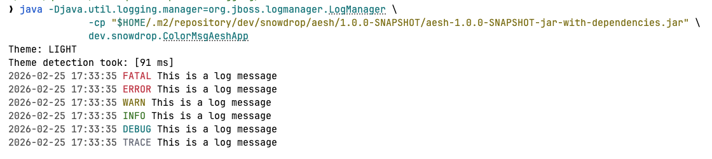

**2. Dark theme**

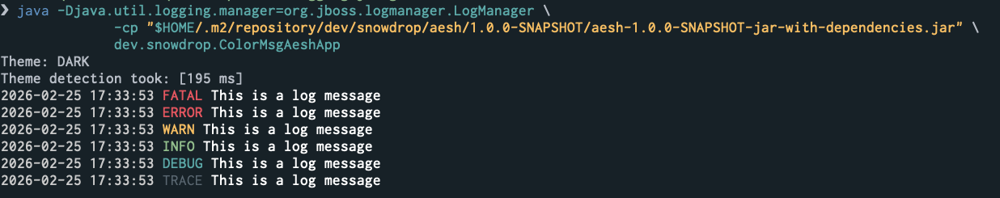

## Standalone application using JBoss LogManager

Using the JBoss LogManager and a ColorHandler for colorize and format the messages
```bash
set LOGMANAGER_GAV "$HOME/.m2/repository/dev/snowdrop/logmanager/1.0.0-SNAPSHOT/logmanager-1.0.0-SNAPSHOT-jar-with-dependencies.jar"
alias colorWithLogManager='java -Djava.util.logging.manager=org.jboss.logmanager.LogManager -cp $LOGMANAGER_GAV dev.snowdrop.ColorMsgLogManagerApp'
colorWithLogManager

or 

java -Djava.util.logging.manager=org.jboss.logmanager.LogManager \
  -cp "$HOME/.m2/repository/dev/snowdrop/logmanager/1.0.0-SNAPSHOT/logmanager-1.0.0-SNAPSHOT-jar-with-dependencies.jar" \
  dev.snowdrop.ColorMsgLogManagerApp
```

**1. Light Theme**

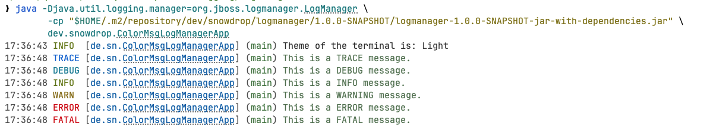

**2. Dark theme**

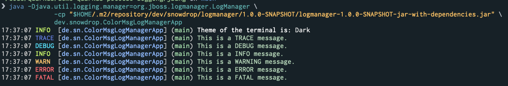

## JBang Application using JBoss LogManager

Using the JBoss LogManager and a ColorHandler for colorize and format the messages
```bash
jbang ./jbang/src/main/java/dev/snowdrop/ColorMsgLogManagerJBangApp.java
```

**1. Light Theme**

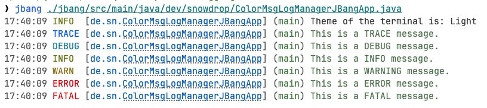

**2. Dark theme**

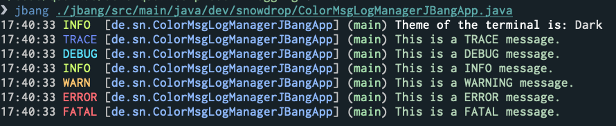


## Picocli

Using Picocli, Aesh and JBoss LogManager to colorize and format the messages
```bash
set PICOCLI_GAV "$HOME/.m2/repository/dev/snowdrop/picocli/1.0.0-SNAPSHOT/picocli-1.0.0-SNAPSHOT-jar-with-dependencies.jar"
alias colorWithPicocli='java -Djava.util.logging.manager=org.jboss.logmanager.LogManager -cp $PICOCLI_GAV dev.snowdrop.ColorMsgPicocliApp'
```

**1. Using JBoss Loggger**
```bash
colorWithPicocli --name snowdrop
```

**2. Use picocli printwriter out/err**
```bash
colorWithPicocli --name snowdrop -c
```

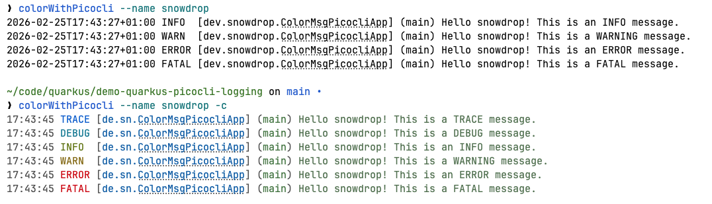

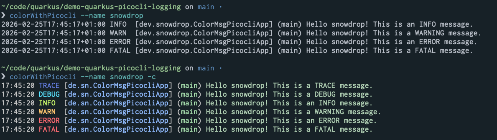

## Quarkus & Picocli

Using Quarkus Picocli, Aesh and JBoss LogManager to colorize and format the messages

**1. Default Quarkus Logger disabled**
```bash
java -Dquarkus.log.console.enabled=false -Djava.util.logging.manager=org.jboss.logmanager.LogManager -jar ./target/quarkus-picocli-1.0.0-SNAPSHOT-runner.jar 
```
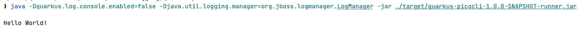

**2. Logging messages using Quarkus JBoss logger**
```bash
java -Dquarkus.log.console.enabled=true -Djava.util.logging.manager=org.jboss.logmanager.LogManager -jar ./target/quarkus-picocli-1.0.0-SNAPSHOT-runner.jar 
```
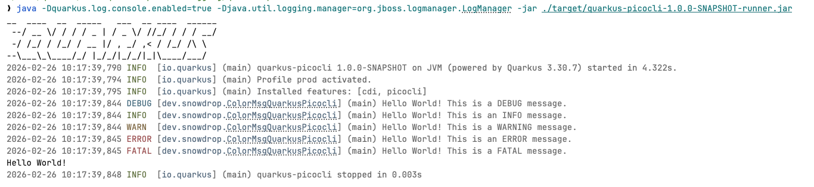

**3. Combining the JBoss LogManager Handler with Picocli PrintWriter (out/err)**
```bash
java -Djava.util.logging.manager=org.jboss.logmanager.LogManager -jar ./target/quarkus-picocli-1.0.0-SNAPSHOT-runner.jar -c
```
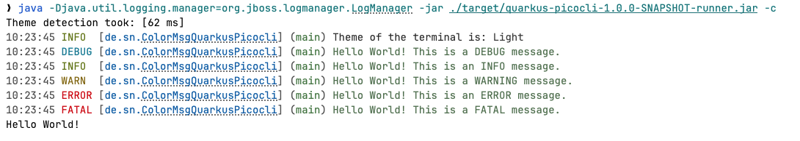

**4. Changing the format of the messages to be logged**
```bash
java -Dcli.log.msg.format="greeting-app: %s%e%n" -Djava.util.logging.manager=org.jboss.logmanager.LogManager -jar ./target/quarkus-picocli-1.0.0-SNAPSHOT-runner.jar -c 
```
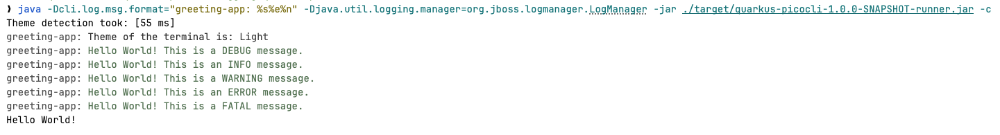