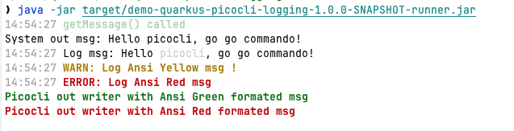
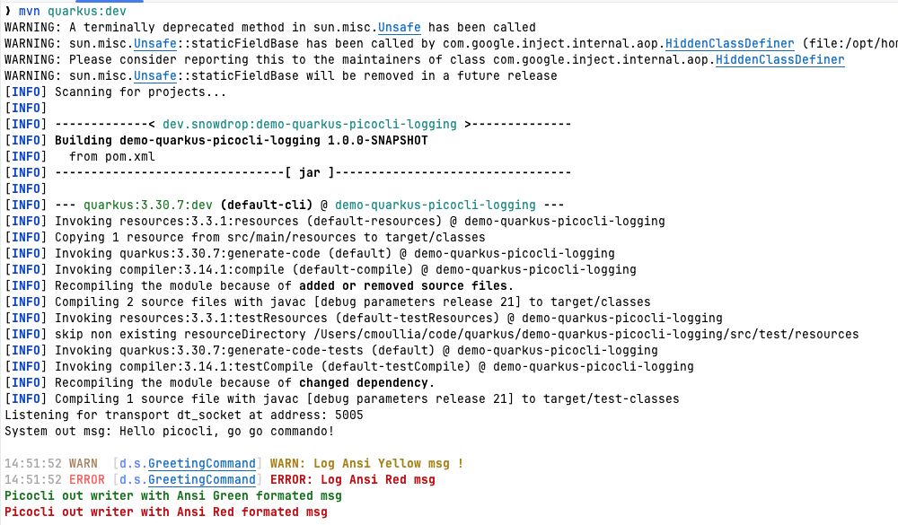

# Simple project to experiment: quark
us picocli and logging

Simple project to configure properly the logging depending on if we launch Picocli according to the following modes:
- `CLI` runs using the `uber` jar file then we use `ANSI console messages`



- `quarkus:dev` mode, then the traditional logging is used




To support both modes, a property has been created and the format odf the messages logged adapted
```properties
# Quarkus banner and log
quarkus.banner.enabled=false

# format parameters - https://quarkus.io/guides/logging
%dev.quarkus.log.console.format=%d{HH:mm:ss} %-5p [%c{1.}] %s%e%n
# If we use WARN, then no io.quarkus INFO messages will be displayed
%dev.quarkus.log.level=INFO
%dev.quarkus.log.category."io.quarkus".level=WARN
%dev.app.cli.mode=false

#%prod.quarkus.log.console.format=%d{HH:mm:ss} %s%e%n
%prod.quarkus.log.level=INFO
%prod.quarkus.log.category."io.quarkus".level=WARN
%prod.quarkus.log.console.format=%d{HH:mm:ss} %s%e%n
%prod.app.cli.mode=true
```

The `LoggingFormatingService` java class will handle according to the property set, the corresponding lmogging message
```java
package dev.snowdrop.service;

import jakarta.enterprise.context.ApplicationScoped;
import org.eclipse.microprofile.config.inject.ConfigProperty;
import org.jboss.logging.Logger;
import picocli.CommandLine;

@ApplicationScoped
public class LoggingFormatingService {
    private static final Logger logger = Logger.getLogger(MessageService.class);
    private final String ANSI_WARN = "@|bold,yellow WARN: %s |@";
    private final String ANSI_ERROR = "@|bold,red ERROR: %s |@";
    private CommandLine.Model.CommandSpec spec;

    @ConfigProperty(name = "app.cli.mode", defaultValue = "false")
    boolean isCliMode;

    public LoggingFormatingService() {
    }

    public void info(String message) {
        if (isCliMode) {
            spec.commandLine().getOut().println(
                CommandLine.Help.Ansi.AUTO.string(message));
        } else {
            logger.info(message);
        }
    }

    public void warn(String message) {
        if (isCliMode) {
            spec.commandLine().getOut().println(
                CommandLine.Help.Ansi.AUTO.string(String.format(ANSI_WARN, message)));
        } else {
            logger.warn(message);
        }
    }

    public void error(String message) {
        if (isCliMode) {
            spec.commandLine().getOut().println(
                CommandLine.Help.Ansi.AUTO.string(String.format(ANSI_ERROR, message)));
        } else {
            logger.error(message);
        }
    }

    public void setSpec(CommandLine.Model.CommandSpec spec) {
        this.spec = spec;
    }
}
```

To use it, instantiate the service and use the method `setSpec` to provide the Picocli `CommandSpec` (see detail [here](https://picocli.info/apidocs/picocli/CommandLine.Model.CommandSpec.html)) able to log to the stdout or stderr the messages
formated using ANSI

```java
package dev.snowdrop;

import dev.snowdrop.service.LoggingFormatingService;
import jakarta.inject.Inject;
import picocli.CommandLine;
import picocli.CommandLine.Command;

@Command(name = "greeting", mixinStandardHelpOptions = true)
public class GreetingCommand implements Runnable {
    
    @Inject
    LoggingFormatingService LOG;

    @Override
    public void run() {
        msgService.with("picocli");

        // Pass the Picocli Command Spec to the LOG service
        LOG.setSpec(spec);
```

## Running the application in dev mode

You can run your application in dev mode that enables live coding using:

```shell script
./mvnw quarkus:dev
```

> **_NOTE:_**  Quarkus now ships with a Dev UI, which is available in dev mode only at <http://localhost:8080/q/dev/>.

## Packaging and running the application

The application can be packaged using:

```shell script
./mvnw package
```

It produces the `quarkus-run.jar` file in the `target/quarkus-app/` directory.
Be aware that it’s not an _über-jar_ as the dependencies are copied into the `target/quarkus-app/lib/` directory.

The application is now runnable using `java -jar target/quarkus-app/quarkus-run.jar`.

If you want to build an _über-jar_, execute the following command:

```shell script
./mvnw package -Dquarkus.package.jar.type=uber-jar
```

The application, packaged as an _über-jar_, is now runnable using `java -jar target/*-runner.jar`.

## Related Guides

- Picocli ([guide](https://quarkus.io/guides/picocli)): Develop command line applications with Picocli

## Provided Code

### Picocli Example

Hello and goodbye are civilization fundamentals. Let's not forget it with this example picocli application by changing the <code>command</code> and <code>parameters</code>.

[Related guide section...](https://quarkus.io/guides/picocli#command-line-application-with-multiple-commands)

Also for picocli applications the dev mode is supported. When running dev mode, the picocli application is executed and on press of the Enter key, is restarted.

As picocli applications will often require arguments to be passed on the commandline, this is also possible in dev mode via:

```shell script
./mvnw quarkus:dev -Dquarkus.args='Quarky'
```
